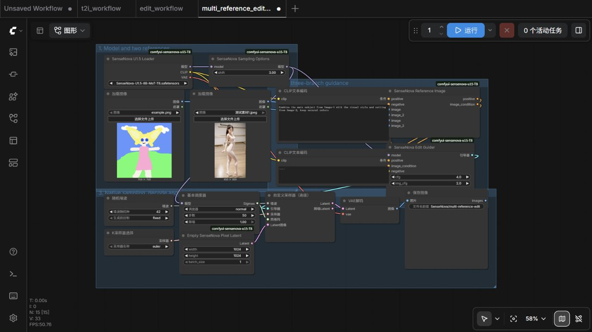

# SenseNova-U1.5 ComfyUI 节点

[](https://github.com/T8mars/SenseNova-U1.5-Wrapper-T8/actions/workflows/ci.yml)

这是 SenseNova-U1.5 的 ComfyUI 原生节点。模型、采样器、调度器、显存卸载和工作流都走 ComfyUI 管道，支持：

- 文生图
- 单图编辑
- 1～10 张参考图编辑
- 普通 `KSampler`
- 自定义 `img_cfg` 的三路引导
- 执行期间的文本/参考图 prefix KV cache

节点只读取本地模型，运行时不会联网下载文件。

## 安装

最简单的方法是在 ComfyUI-Manager 里搜索 `SenseNova U1.5 (T8)`，安装后重启 ComfyUI。

- Registry：[sensenova-u15-t8](https://registry.comfy.org/nodes/sensenova-u15-t8)
- Comfy CLI：`comfy node install sensenova-u15-t8`

也可以手动安装：

```bash
cd ComfyUI/custom_nodes
git clone https://github.com/T8mars/SenseNova-U1.5-Wrapper-T8.git
```

本项目没有额外的 Python 依赖。

## 下载模型

- [Hugging Face：t8star/SenseNova-U1.5-Comfy](https://huggingface.co/t8star/SenseNova-U1.5-Comfy/)
- [模型网盘](https://pan.quark.cn/s/c9c267081fbf)

下载单文件模型 `SenseNova-U1.5-8B-MoT-T8.safetensors`，放到：

```text
ComfyUI/models/diffusion_models/
```

模型约 50 GB。Manager 只安装节点，不会自动下载模型。

## 直接使用工作流

下载下面的 JSON，直接拖进 ComfyUI。编辑工作流打开后，先在 `Load Image` 中选择自己的图片。

- [文生图工作流](examples/t2i_workflow.json)
- [普通编辑工作流（img_cfg=1）](examples/edit_workflow.json)
- [多参考三路编辑工作流](examples/multi_reference_edit_workflow.json)

推荐先保持这些参数：

```text
steps: 50
CFG: 4
img_cfg: 1
shift: 3
sampler: euler
scheduler: normal
denoise: 1
```

### 文生图


连接顺序很简单：

```text
Loader → Sampling Options → KSampler → VAE Decode → Save Image
```

`MODEL` 必须先经过 `SenseNova Sampling Options`，`shift` 保持 `3`。

### 普通图像编辑


参考图要接到 `SenseNova Reference Image`，不要把参考图当作 latent。`img_cfg=1` 时，可以继续用普通 `KSampler`；把节点输出的 `image_condition` 接到 KSampler 的 negative。

### 多参考图和三路编辑



`SenseNova Reference Image` 可以连接 1～10 张图。提示词里可以直接写 `Image-1`、`Image-2`，例如：

```text
Use Image-1 as the illustration style and Image-2 as the food subject.
```

当 `img_cfg` 不是 1 时，要使用 `SenseNova Edit Guider` 和 ComfyUI 自带的 `SamplerCustomAdvanced`。最重要的一点：`Sampling Options` 输出的同一个 MODEL，要同时连接 `Edit Guider` 和 `BasicScheduler`。

```text
SenseNova Sampling Options (MODEL)
├── SenseNova Edit Guider ───────────┐
└── BasicScheduler ──────────────────┤
RandomNoise + KSamplerSelect + Latent├──→ SamplerCustomAdvanced
                                     ┘
```

节点会按官方规则给每张图插入 `Image-1`、`Image-2` 等标签，并分别处理尺寸，不会把多张图片简单拼接。

## 实际结果

下面两张图都由本节点生成，参数不是后期调色结果。

### 2048×2048 文生图

[查看原始 2048×2048 PNG](docs/images/result-t2i-2048.png)


参数：2048×2048、50 步、CFG 4、shift 3、Euler/normal、seed 42。24 GB 显存实测完成。

### 2048×2048 双参考图编辑

[查看原始 2048×2048 PNG](docs/images/result-multi-reference-2048.png)


参数：2048×2048、50 步、CFG 4、img_cfg 1、shift 3、Euler/normal、seed 42。第一张图提供手账版式和文字密度，第二张图提供炸鸡主体；提示词明确要求标题、材料、三步做法和小贴士。大标题、材料和主要步骤可读，局部小字仍有错字和重叠，本图没有后期修字。24 GB 显存实测完成。

## KV cache 做了什么

SenseNova 的文字和参考图 prefix 在每一步都相同。`SenseNova Sampling Options` 会在一次采样任务内缓存它们，后续 step 直接复用，避免重复计算参考图。

缓存只存在于当前任务中；任务完成、报错或取消时都会清空，不会跨任务保存，也不会偷偷占用长期显存。缓存与无缓存的三路编辑 A/B 测试结果逐元素一致。

## 颜色太艳怎么办

先检查提示词里有没有 `bright`、`vivid`、`neon`、`highly saturated`。这些词会明显提高饱和度。建议：

- `CFG` 先用 4，不满意再试 3～3.5
- `img_cfg` 先保持 1
- 提示词加入 `natural colors`、`restrained color grading`

## 运行要求

当前实测环境：

- ComfyUI `v0.31.0-8`，commit `cbbc9dab1f03d0d9a6caa8a8be7d77a7e37e1e44`
- NVIDIA CUDA + BF16
- RTX 5090 Laptop 24 GB
- 64 GB 系统内存

2048×2048、50 步文生图和双参考图编辑都能在 24 GB 显存下完成。模型加载和卸载还会占用较多系统内存，建议准备 64 GB RAM 和足够的虚拟内存。

## 当前限制

- batch size 只支持 1
- 只验证了 NVIDIA CUDA + BF16
- 不支持运行时自动下载模型
- 量化、8-step LoRA、CFG norm、bbox/marker 和 think mode 暂未开放
- FP16、ROCm、MPS、DirectML、XPU、NPU 暂未验证

## 模型校验

```text
大小：50,222,155,152 bytes
SHA256：2e5c4451969a8af9d7bcbf9d00a0fe463b15ed44149d8d79f31409e671587615
tensor：1116
revision：1f6ec60423d29939dde4202fd82ae340b144e280
```

节点会检查模型 metadata、全部 tensor 名称、shape 和存储 dtype。如果下载不完整或版本不对，会直接报错，不会静默加载错误权重。

API 格式示例仍保留在 `examples` 目录：

- [文生图 API](examples/t2i_api.json)
- [普通编辑 API](examples/edit_two_way_api.json)
- [三路编辑 API](examples/edit_api.json)

## 其他链接

- [B站](https://space.bilibili.com/385085361)
- [YouTube](https://www.youtube.com/@T8star-Aix/)
- [AI API](https://api.seedance.nz/sign-up?aff=5f4w)
- [在线 AI 应用](https://www.runninghub.ai/zh-cn/user-center/1907375370302308353/userPost?inviteCode=rh-v1121)
- [ComfyUI 整合包](https://pan.quark.cn/s/264edb7e36bd)
- [模型网盘](https://pan.quark.cn/s/c9c267081fbf)
- [Hugging Face 主页](https://huggingface.co/t8star)

## 来源与许可

SenseNova-U1.5 模型和参考实现来自 [OpenSenseNova/SenseNova-U1](https://github.com/OpenSenseNova/SenseNova-U1)，原项目使用 Apache License 2.0。

本仓库只提供 ComfyUI 本地推理适配，不包含模型权重。详细归因见 [NOTICE](NOTICE)。
