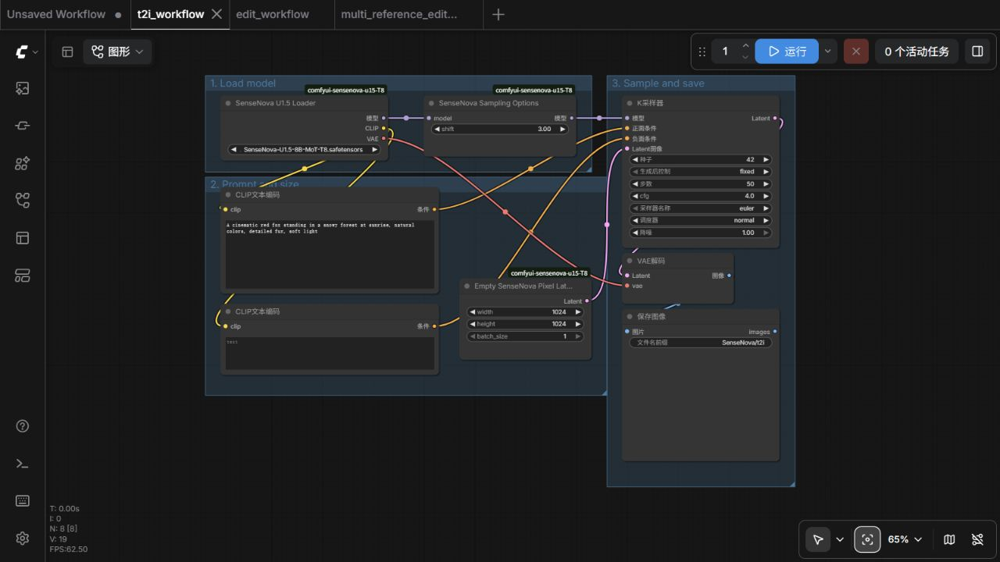
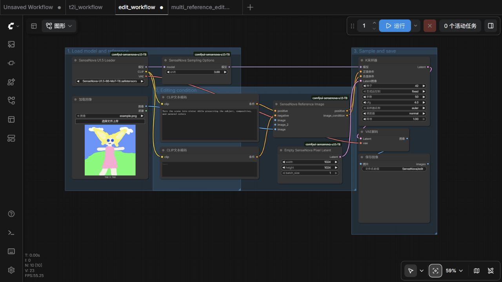

# SenseNova-U1.5 ComfyUI 节点（ANT 分支）

[English](README.md) | 简体中文

[](https://github.com/Spirindzhiukas/Comfyui-SenseNova-U1.5-Wrapper-T8-ANT-fork/actions/workflows/ci.yml)

[版本更新记录](CHANGELOG.md) · [GitHub Releases](https://github.com/Spirindzhiukas/Comfyui-SenseNova-U1.5-Wrapper-T8-ANT-fork/releases)

> **本分支没有发布到 ComfyUI Registry**，也无法在 ComfyUI-Manager 里按名字搜索到，
> 请用 Git 安装（见[安装](#安装)）。Registry 上的 `sensenova-u15-t8` 属于上游作者
> [T8mars](https://github.com/T8mars/Comfyui-SenseNova-U1.5-Wrapper-T8)。

## 本分支说明

本仓库是 `T8mars/Comfyui-SenseNova-U1.5-Wrapper-T8` 的维护分支，上游功能与修复已同步至 **1.5.2**，并在其上
移植了 `Milor123/ComfyUI-SenseNova-U1.5-ConvRot` 的 ConvRot 量化支持，再加上本分支
自己的修复（详见 [`memory.md`](memory.md) 与 [`README.md`](README.md)（英文主文档））。
逐文件说明“哪些代码来自 T8mars、哪些移植自 Milor123、本分支改了什么”，见英文主文档的
[Credits and provenance](README.md#credits-and-provenance) 一节。除上述移植与修复外，本分支在上游功能之上还增加了：

- 界面全面英文化：节点名、插槽名、结构化编辑提示默认值、前端扩展与内置示例工作流；
  上游中文原文保留为注释，方便继续合并 T8mars 更新。
- Windows 换行符兼容：tokenizer 校验同时比对 CRLF→LF 规范化摘要，`core.autocrlf=true`
  的克隆不再报 `tokenizer asset digest mismatch`。
- ConvRot 量化权重（可选）：INT8（约 17.6 GB）、ConvRot W4A4、非对称 W4A8
  （约 13.8 GB）以及按层混合，官方 BF16 加载路径保持不变。
- `tools/` 下附带量化转换脚本。

这是 SenseNova-U1.5 的 ComfyUI 原生节点。模型、采样器、调度器、显存卸载和工作流都走 ComfyUI 管道，支持：

- 文生图
- Thinking 推理后生图
- 文本/图像交错生成，并把生成图回填到后续轮次
- 单图编辑
- 1～10 张参考图编辑
- 同一提示词/参考图一次生成 1～16 个不同结果
- 普通 `KSampler`
- U1.5 Final 和 U1.5 SFT 两套官方权重
- Final 的 Q2_K、Q3_K_M、Q5_K_M、Q6_K、Q8_0 GGUF 量化
- 官方 U1.5 8-step LoRA（底层使用 ComfyUI 原生 LoRA/ModelPatcher 管道）
- 自定义 `img_cfg` 的三路引导、CFG Norm 和 CFG 生效区间
- 用明确的“修改 / 参考图职责 / 保持 / 禁止”结构整理复杂编辑提示词
- 执行期间的文本/参考图 prefix KV cache

节点只读取本地模型，运行时不会联网下载文件。

## 安装

请用 Git 安装。本分支没有发布到 ComfyUI Registry，不能用 `comfy node install`，
也无法在 ComfyUI-Manager 里按名字搜索到：

```bash
cd ComfyUI/custom_nodes
git clone https://github.com/Spirindzhiukas/Comfyui-SenseNova-U1.5-Wrapper-T8-ANT-fork.git
```

然后重启 ComfyUI。以后更新：

```bash
cd ComfyUI/custom_nodes/Comfyui-SenseNova-U1.5-Wrapper-T8-ANT-fork
git pull
```

在 ComfyUI-Manager 里也可以使用“Install via Git URL”，地址相同。不要同时安装上游的
`SenseNova U1.5 (T8)` Registry 版本：`custom_nodes/` 下出现两份相同节点 id 是
`checkpoint key mismatch` 最常见的原因。

依赖：

- GGUF 支持需要 `gguf >= 0.13.0`，正常安装本仓库时会由 `pyproject.toml` 安装。
- BF16 路径没有额外的运行时依赖。
- 可选的量化（ConvRot）路径使用 ComfyUI 环境中的 `comfy-kitchen`，建议 `>= 0.2.31`
  （它的 INT8 kernel 才真正执行 ConvRot 旋转）；更旧的版本仍可使用，本节点会在加载时
  实测 kernel 行为并自动切换到自带的 ConvRot 实现。

想使用 Registry 上的上游版本，请到
[T8mars/Comfyui-SenseNova-U1.5-Wrapper-T8](https://github.com/T8mars/Comfyui-SenseNova-U1.5-Wrapper-T8)；
它不能加载量化后的 ConvRot 权重。

## 下载模型

### 哪个仓库有哪些模型

本节点会用到的权重由两个社区仓库发布，内容不同；模型本身由 OpenSenseNova 发布，
两个社区仓库发布的都是官方权重转换后的版本。

| 仓库 | 发布者 | 内容 |
|---|---|---|
| [`t8star/SenseNova-U1.5-Comfy`](https://huggingface.co/t8star/SenseNova-U1.5-Comfy/) | **T8mars**（本分支所基于的上游封装作者） | **全精度（BF16）权重**：全 BF16 Final（约 35 GB）、旧版混合精度 Final（约 50 GB）、SFT（约 35 GB）、ComfyUI 原生键名的 8-step LoRA（约 815 MB），并附带每份权重的 `*.manifest.json`。网盘镜像：[夸克](https://pan.quark.cn/s/6b756fdae32d) |
| [`Milor123/ComfyUI-ConvRot-SenseNova-U1.5-8B-MoT-T8`](https://huggingface.co/Milor123/ComfyUI-ConvRot-SenseNova-U1.5-8B-MoT-T8) | **Milor123**（ConvRot 量化分支作者，量化代码即移植自他的仓库） | **量化 ConvRot 权重**：INT8-ConvRot（约 17.6 GiB，推荐的量化文件）与混合 INT8+W4A8 `L18-41`（约 13.8 GiB），`Loras/` 下另有一份相同的 8-step LoRA |
| [`realrebelai/SenseNova-U1.5-8B_GGUFs`](https://huggingface.co/realrebelai/SenseNova-U1.5-8B_GGUFs) | **realrebelai** | Final 的 Q2_K、Q3_K_M、Q5_K_M、Q6_K、Q8_0 GGUF 文件 |
| [`sensenova/SenseNova-U1.5-8B-MoT`](https://huggingface.co/sensenova/SenseNova-U1.5-8B-MoT) · [`-SFT`](https://huggingface.co/sensenova/SenseNova-U1.5-8B-MoT-SFT) · [`-LoRAs`](https://huggingface.co/sensenova/SenseNova-U1.5-8B-MoT-LoRAs) | **OpenSenseNova**（模型作者） | 两个社区仓库转换所依据的**官方原始权重**；需要自己转换时才用：raw LoRA 需要 `tools/convert_lora_to_comfy.py`，分片权重需要 `tools/merge_safetensors.py` |

简单记法：**BF16 权重在 `t8star` 仓库，量化权重在 `Milor123` 仓库。**

三点注意事项：

- Milor123 的量化权重由**旧版混合精度 Final**（revision `1f6ec604`）转换而来，因此
  这里按 `final_legacy` 校验；元数据注入工具的 `--variant auto`（默认）会自动保留该标签。
- 8-step LoRA 在两个仓库里是**同一个文件**（逐字节相同，SHA256 `dd5320f0…`），
  从任意一个仓库下载即可。
- 没有任何仓库发布 ConvRot **W4A4**（约 11 GB）文件，需要用
  `tools/convert_sensenova_int4_convrot.py` 自行转换。

### BF16 / 官方精度文件 —— `t8star/SenseNova-U1.5-Comfy`

按需要下载：

| 文件 | 放置位置 | 用途 |
|---|---|---|
| `SenseNova-U1.5-8B-MoT-BF16-T8.safetensors` | `ComfyUI/models/diffusion_models/` | U1.5 Final 新版全 BF16 单文件，约 35 GB，推荐下载 |
| `SenseNova-U1.5-8B-MoT-T8.safetensors` | `ComfyUI/models/diffusion_models/` | U1.5 Final 旧版混合精度单文件，约 50 GB，继续兼容 |
| `SenseNova-U1.5-8B-MoT-SFT-T8.safetensors` | `ComfyUI/models/diffusion_models/` | U1.5 SFT 单文件底模，约 35 GB |
| `SenseNova-U1.5-8B-MoT-LoRA-8step-ComfyUI.safetensors` | `ComfyUI/models/loras/` | 官方 8-step LoRA 的 ComfyUI 原生键名版本，约 815 MB |

底模路径：

```text
ComfyUI/models/diffusion_models/
```

LoRA 路径：

```text
ComfyUI/models/loras/
```

### 量化 ConvRot 文件 —— `Milor123/ComfyUI-ConvRot-SenseNova-U1.5-8B-MoT-T8`

| 文件 | 放置位置 | 用途 |
|---|---|---|
| `SenseNova-U1.5-8B-MoT-T8-int8-convrot-tagged.safetensors` | `ComfyUI/models/diffusion_models/` | INT8 + ConvRot，约 17.6 GiB，推荐的量化文件 |
| `SenseNova-U1.5-8B-MoT-T8-hybw4a8-L18-41.safetensors` | `ComfyUI/models/diffusion_models/` | 混合精度：第 0～17 层 INT8，第 18～41 层非对称 W4A8，约 13.8 GiB |
| `Loras/SenseNova-U1.5-8B-MoT-LoRA-8step-ComfyUI.safetensors` | `ComfyUI/models/loras/` | 与 `t8star` 仓库中相同的 8-step LoRA |

这些文件已经带有所需的 SenseNova 元数据标签，不需要再运行注入工具。放到
`ComfyUI/models/diffusion_models/SenseNovaU1.5/` 这样的子目录也可以，ComfyUI 会列出它。
安装节点与下载权重是分开的两步，节点本身不会下载任何模型。

Final 和 SFT 都是 SenseNova U1.5，本节点都支持 50 步文生图和图像编辑。新版 BF16 Final 是官方在相同 Final 模型上进行的全 BF16 转换和重新分片；节点同时严格支持新版 35 GB Final 和旧版 50 GB Final。SFT 是不同训练阶段的独立权重，不要混为同一个文件。

注意：官方 8-step LoRA 必须搭配 Final，不能搭配 SFT 或 Preview。专用的 `SenseNova U1.5 8-Step LoRA` 节点会检查底模，接错时直接给出说明。

| 文件/组合 | 本节点支持 | 说明 |
|---|---:|---|
| U1.5 Final BF16，50 步生成/编辑 | ✅ | 当前推荐模型，约 35 GB |
| U1.5 Final 旧版混合精度，50 步生成/编辑 | ✅ | 兼容已有下载，约 50 GB |
| U1.5 Final + `-ComfyUI` 8-step LoRA | ✅ | 仅用于 8 步文生图 |
| U1.5 SFT，50 步生成/编辑 | ✅ | 独立单文件底模，不叠加 8-step LoRA |
| U1.5 Preview | ❌ | 旧预览权重 |
| 官方未转换的 raw LoRA | ❌ | 先使用仓库转换工具，或直接下载 `-ComfyUI` 文件 |

## 直接使用工作流

下面都是 ComfyUI 画布工作流，下载 JSON 后可以直接拖进 ComfyUI。没有 API 工作流。编辑工作流打开后，先在 `Load Image` 中选择自己的图片。

- [文生图工作流](examples/t2i_workflow.json)
- [Thinking 文生图工作流](examples/thinking_t2i_workflow.json)
- [文本/图像交错生成工作流](examples/interleave_workflow.json)
- [GGUF 文生图工作流](examples/gguf_t2i_workflow.json)
- [GGUF 图像编辑工作流](examples/gguf_edit_workflow.json)
- [批量文生图工作流（默认一次 2 张）](examples/batch_t2i_workflow.json)
- [8-step LoRA 文生图工作流](examples/t2i_8step_workflow.json)
- [普通编辑工作流（img_cfg=1）](examples/edit_workflow.json)
- [稳定多参考编辑工作流（人物换装案例）](examples/multi_reference_edit_workflow.json)
- [SFT 文生图工作流](examples/sft_t2i_workflow.json)
- [SFT 图像编辑工作流](examples/sft_edit_workflow.json)

### ComfyUI core 原生工作流

下面两个工作流用于已包含 SenseNova U1.5 core 支持的 ComfyUI，不依赖本仓库的自定义 Loader：

- [core 原生文生图工作流](examples/core_t2i_workflow.json)
- [core 原生图像编辑工作流](examples/core_edit_workflow.json)

core 工作流使用 ComfyUI 自带的 `CheckpointLoaderSimple`，因此底模要放到 `ComfyUI/models/checkpoints/`。8-step LoRA 可直接使用自带的 `LoraLoaderModelOnly`，LoRA 文件仍放在 `ComfyUI/models/loras/`。

推荐先保持这些参数：

```text
steps: 50
CFG: 4
img_cfg: 1
shift: 3
sampler: euler
scheduler: normal
denoise: 1
```

`Empty SenseNova Pixel Latent` 还提供官方建议的分辨率预设；选择 `Custom` 时继续使用节点上的 width 和 height：

| 比例 | 分辨率 |
|---|---:|
| 1:1 | 2048 × 2048 |
| 16:9 | 2720 × 1536 |
| 9:16 | 1536 × 2720 |
| 2:3 | 1664 × 2496 |
| 3:2 | 2496 × 1664 |

复杂编辑建议在 `SenseNova Edit Guider` 中先用：

```text
CFG: 4
img_cfg: 1
cfg_norm: global
cfg_interval: 0 → 1
```

`global` 会把过强的引导幅度拉回正向条件的范围，通常能减轻高饱和、过度锐化和主体漂移；如果结果变得太保守，再切回 `none`。`channel` 按 32×32 生成 token 分别归一化，适合局部区域容易过冲的场景。

`cfg_interval` 使用 ComfyUI 的归一化去噪进度，`0` 是第一步、`1` 是最后一步，起止点都包含在区间内。这里有意让 start 和 end 始终都生效，避免官方参考代码在 `start=0` 时忽略 end 的边界问题；保持 `0 → 1` 就是官方默认的全程 CFG。

8-step LoRA 请用官方参数：

```text
LoRA strength: 1
steps: 8
CFG: 1
cfg_norm: none（CFG=1 时不做额外 CFG norm）
shift: 3
sampler: euler
scheduler: normal
denoise: 1
```

### 文生图



连接顺序很简单：

```text
Loader → Sampling Options → KSampler → VAE Decode → Save Image
```

`MODEL` 必须先经过 `SenseNova Sampling Options`，`shift` 保持 `3`。

### 批量生成

把 `Empty SenseNova Pixel Latent` 的 `batch_size` 改成 `2～16`，同一个提示词会产生多张不同结果，`Save Image` 会逐张保存。批量编辑也走同一接口，所有结果共用同一组参考图；目前完整实测范围是 `512×512、batch_size=2`，更大的编辑批量需要根据参考图数量和显存逐步增加。

显存开销会随批量增加。示例工作流默认用 `768×768、batch_size=2`；不要直接用 `2048×2048、batch_size=16`。24 GB 显存建议从 `512/768、batch_size=2` 开始。

双参考换装的 `512×512、batch_size=2、50 步` 完整编辑实测用时约 495 秒，两张结果不同且都遵守换装要求；任务期间整张显卡显存采样峰值为 22,986 MiB。

### 8-step LoRA 文生图

8-step 工作流使用本项目的保护节点，内部仍走 ComfyUI 原生 LoRA 映射和 `ModelPatcher`：

```text
SenseNova Loader (Final) → SenseNova U1.5 8-Step LoRA → Sampling Options → KSampler
```

LoRA 强度保持 `1`。这个 LoRA 是官方发布的快速文生图适配器；图像编辑仍建议使用不加 LoRA 的 50 步编辑工作流。

### 普通图像编辑



参考图要接到 `SenseNova Reference Image`，不要把参考图当作 latent。`img_cfg=1` 时，可以继续用普通 `KSampler`；把节点输出的 `image_condition` 接到 KSampler 的 negative。

### 多参考图和自定义引导

普通的 `SenseNova Reference Image` 节点只显示 `Image-1` 和可选的 `Image-2`，不会再多出一个容易误接的空白第三插槽。需要 3～10 张图时，改用 `SenseNova Reference Images (1-10)` 节点。图像顺序就是提示词中的 `Image-1`、`Image-2`。人物换装时，`Image-1` 放人物主图，`Image-2` 放服装图。旧版工作流中的 `images.image` 名称会在导入时自动迁移；旧工作流使用 3 张以上参考图时，也会自动切换到 1～10 张版本。

复杂任务不要只写“让她穿上这件衣服”。可以使用 `SenseNova Structured Edit Prompt` 节点，把要求拆成四项：主要修改、每张参考图的职责、必须保持的内容、禁止出现的内容；也可以直接照下面的格式写进 `CLIP Text Encode`：

```text
【主要修改】让 Image-1 的人物穿上 Image-2 的服装。
【参考图职责】Image-1 只提供人物；Image-2 只提供服装，不复制人台和背景。
【必须保持】保持 Image-1 的脸、姿势、光线、背景和画幅不变。
【禁止出现】不要增加第二个人，不要改变未指定区域。
```

当 `img_cfg` 不是 1 时，要使用 `SenseNova Edit Guider` 和 ComfyUI 自带的 `SamplerCustomAdvanced`。最重要的一点：`Sampling Options` 输出的同一个 MODEL，要同时连接 `Edit Guider` 和 `BasicScheduler`。

```text
SenseNova Sampling Options (MODEL)
├── SenseNova Edit Guider ───────────┐
└── BasicScheduler ──────────────────┤
RandomNoise + KSamplerSelect + Latent├──→ SamplerCustomAdvanced
                                     ┘
```

节点会按官方规则给多张图插入 `Image-1`、`Image-2` 等标签，并分别处理尺寸，不会把多张图片简单拼接。稳定工作流已经使用 `CFG 4、img_cfg 1、global CFG Norm`；它优先保留人物身份和原始构图，不会为了“改得更多”盲目把 `img_cfg` 拉高。

## 实际结果

下面图片都由本节点生成，参数不是后期调色结果。

### 2048×2048 双参考人物换装

[查看原始 2048×2048 PNG](docs/images/result-garment-edit-2048.png)


参数：Final 单文件底模、2048×2048、50 步、CFG 4、img_cfg 1、global CFG Norm、shift 3、Euler/normal、seed 31082026。Image-1 提供人物、脸、姿势和背景，Image-2 只提供黑白裙装；输出保留了托腮手势与室内构图，并迁移了白色围裙、荷叶边、蝴蝶结和袖口。没有后期修图，RTX 5090 Laptop 24 GB 上任务约 506 秒完成。

### U1.5 SFT：2048×2048、50 步文字密集文生图

[查看原始 2048×2048 PNG](docs/images/result-sft-t2i-2048.png)


参数：SFT 单文件底模、2048×2048、50 步、CFG 4、shift 3、Euler/normal、seed 42。标题、材料数量、3 个步骤和 170°C 提示直接由模型生成，没有后期修字。RTX 5090 Laptop 24 GB 上任务约 297 秒完成。

### 2048×2048、8 步文字密集文生图

[查看原始 2048×2048 PNG](docs/images/result-t2i-8step-2048.png)


参数：2048×2048、8 步、CFG 1、shift 3、LoRA strength 1、Euler/normal、seed 42。标题、副标题、5 项材料、3 个步骤和温度提示均直接由模型生成，没有后期修字。RTX 5090 Laptop 24 GB 上任务约 86 秒完成。

### 2048×2048 文生图

[查看原始 2048×2048 PNG](docs/images/result-t2i-2048.png)


参数：2048×2048、50 步、CFG 4、shift 3、Euler/normal、seed 42。24 GB 显存实测完成。

### 2048×2048 双参考图编辑

[查看原始 2048×2048 PNG](docs/images/result-multi-reference-2048.png)


参数：2048×2048、50 步、CFG 4、img_cfg 1、shift 3、Euler/normal、seed 42。第一张图提供手账版式和文字密度，第二张图提供炸鸡主体；提示词明确要求标题、材料、三步做法和小贴士。大标题、材料和主要步骤可读，局部小字仍有错字和重叠，本图没有后期修字。24 GB 显存实测完成。

## KV cache 做了什么

SenseNova 的文字和参考图 prefix 在每一步都相同。`SenseNova Sampling Options` 会在一次采样任务内缓存它们，后续 step 直接复用，避免重复计算参考图。批量生成时，文字和参考图 prefix 也只按每个引导分支计算一份，再把每层较小的 KV 扩展到各个结果，不会把整套参考图编码重复 `batch_size` 次。

缓存只存在于当前任务中；任务完成、报错或取消时都会清空，不会跨任务保存，也不会偷偷占用长期显存。缓存与无缓存的三路编辑 A/B 测试结果逐元素一致。

## 颜色太艳怎么办

先检查提示词里有没有 `bright`、`vivid`、`neon`、`highly saturated`。这些词会明显提高饱和度。建议：

- `CFG` 先用 4，不满意再试 3～3.5
- `img_cfg` 先保持 1
- 复杂编辑或画面过冲时把 `cfg_norm` 改成 `global`
- 提示词加入 `natural colors`、`restrained color grading`

## ConvRot 量化权重（本分支新增）

只在使用带 `comfy_quant` 侧车键的量化文件时才会启用；官方 BF16/SFT 文件走与上游
完全一致的严格校验（含文件大小）。转换步骤（需在装有 `comfy-kitchen` 的 ComfyUI
环境里执行）：

```bash
python tools/convert_sensenova_int4_convrot.py -i <官方.safetensors> -o <量化.safetensors> --mode w4a8
# 2) --variant auto（默认）沿用被转换文件自身的来源标签：由旧版混合精度 Final
#    转换出的文件必须保持 final_legacy，由全新全 BF16 Final 转换出的保持 final
python tools/inject_sensenova_metadata.py -i <量化.safetensors> -o <量化-tagged.safetensors> --variant final_legacy
```

然后用 `SenseNova U1.5 Loader (Final / SFT)` 直接加载 tagged 文件即可——与 BF16 使用同一个
加载节点，不需要额外的“量化 Loader”：是否走量化分支完全由每层的 `comfy_quant` 侧车键决定，
因此量化文件与官方 BF16 文件不可能走错代码路径。

加载量化权重时控制台应出现：

```text
Found quantization metadata version 1
Using mixed precision operations
[SenseNova-U1.5] quantized checkpoint detected (int8_tensorwise); loading with mixed-precision quantization ops.
[sensenova-u15] comfy-kitchen INT8 convrot probe on cuda:0: relative error 0.0131 rotated / 1.4142 unrotated -> honours convrot
```

本节点不依赖 comfy-kitchen 的版本号或函数签名：它会在加载时**实测** INT8 kernel 是否真的对
激活做了旋转。若实测结果为 `ignores convrot`，则自动改用本节点自带的 ConvRot 实现，保证权重
始终在正确的基下求值。设置 `SENSENOVA_NO_CONVROT_PROBE=1` 可跳过实测并始终使用本节点实现。

其中前两行来自 ComfyUI 核心，最为关键：缺少它们时打包权重不会被解包，现象是画面出现规则的
方格/棋盘噪声而不报错，并伴随大段 `unet unexpected: [... weight_scale ... comfy_quant]` 警告。
本节点在该情况下会直接报错。若所用 comfy-kitchen 早于 0.2.31（其 INT8 kernel 接收但忽略
convrot 参数），可设置 `SENSENOVA_FORCE_BRIDGE=1` 改用本节点自带的 ConvRot 实现。

相关环境变量：
`SENSENOVA_NO_QUANT`、`SENSENOVA_NO_BRIDGE`、`SENSENOVA_FORCE_BRIDGE`、
`SENSENOVA_NO_QT_GUARDS`（仅在加载量化权重时生效）。默认情况下，只有当前
ComfyUI/comfy-kitchen 自身不支持 convrot 激活旋转时才会安装本分支的 Linear 实现。

## 运行要求

当前实机和 CI 验证范围：

- 实机 ComfyUI `v0.33.x`
- CI：最低支持的 ComfyUI `0.31`，以及当前稳定版 `v0.34.0`
- Python `3.10`、`3.12`、`3.13`、`3.14`
- NVIDIA CUDA + BF16
- RTX 5090 Laptop 24 GB
- 64 GB 系统内存

2048×2048、50 步文生图和双参考图编辑，以及 `512×512、batch_size=2` 的完整模型批量执行，都能在 24 GB 显存下完成。模型加载和卸载还会占用较多系统内存，建议准备 64 GB RAM 和足够的虚拟内存。

## 当前限制

- 只验证了 NVIDIA CUDA + BF16
- 不支持运行时自动下载模型
- 可在本分支加载量化后的 ConvRot 权重；但在 ComfyUI 内直接量化、bbox/标记点控制与 think 模式仍未开放。
- 复杂主体替换、多区域或多约束编辑可能出现内容漂移
- FP16、ROCm、MPS、DirectML、XPU、NPU 暂未验证

## 模型校验

Final BF16（推荐）：

```text
文件：SenseNova-U1.5-8B-MoT-BF16-T8.safetensors
大小：35,065,860,328 bytes
SHA256：a32b117f40ad4575c6709b3ad6efb1c6b743ef1c1c3d75360f14090b997f1d29
官方 revision：19bc874ef6ffc97fda9837b40fc1d1301806158a
tensor：1116（全部 BF16）
```

Final 旧版混合精度（继续兼容）：

```text
文件：SenseNova-U1.5-8B-MoT-T8.safetensors
大小：50,222,155,152 bytes
SHA256：2e5c4451969a8af9d7bcbf9d00a0fe463b15ed44149d8d79f31409e671587615
tensor：1116
revision：1f6ec60423d29939dde4202fd82ae340b144e280
```

SFT：

```text
大小：35,065,860,320 bytes
SHA256：9c105bb4baaf244bbd99f814c36f190228c5878f8889295e3dba285441442f2f
tensor：1116（全部 BF16）
revision：661834c5b5aee0f89958353511d6ac0ccaacb646
```

Milor123 发布的量化权重（均由旧版混合精度 Final 转换而来，按 `final_legacy` 校验）：

```text
文件：SenseNova-U1.5-8B-MoT-T8-int8-convrot-tagged.safetensors
大小：18,872,613,872 bytes（17.58 GiB）
SHA256：f49eb10fd8c51f172a69788a3fe0e68534f69b3e04f7a45b0f042f46aa7da855
格式：int8_tensorwise，convrot
```

```text
文件：SenseNova-U1.5-8B-MoT-T8-hybw4a8-L18-41.safetensors
大小：14,821,019,712 bytes（13.80 GiB）
SHA256：72551898faee2aeada901e407e76987d1de68a323e4d16cccdb02ded471a73db
格式：第 0～17 层 int8_tensorwise，第 18～41 层 asym_w4a8_int8
```

量化文件不做精确文件大小校验（大小取决于转换配方），而是通过派生契约校验 tensor 名称、
shape、每层格式与侧车 dtype，并在加载后检查 `QuantizedTensor` 不变量；上面的哈希用于
校验下载文件。

节点会区分新版 Final、旧版 Final 和 SFT，并检查 metadata、全部 tensor 名称、shape 和各版本的存储 dtype。如果下载不完整或版本不对，会直接报错，不会静默加载错误权重。

### 出现 `checkpoint key mismatch` 怎么办

先把节点更新到 `1.3.5` 或更高版本，然后彻底关闭并重启 ComfyUI。不要通过修改 loader、关闭动态加载或删除报错键来绕过校验，这可能让模型虽然能运行，但输出模糊、偏色或不遵循提示词。

如果更新后仍报错：

- 检查 `ComfyUI/custom_nodes/` 下是否装了两份本节点，旧目录也会被 ComfyUI 导入。
- 对照上面的大小和 SHA256，确认底模是本项目发布的 Final 或 SFT 单文件。
- 保留完整报错；新版错误会同时显示实际 `model=` 和 `loader=` 路径，可直接看出 ComfyUI 加载的是哪一份文件。

8-step LoRA 校验：

```text
官方来源：sensenova/SenseNova-U1.5-8B-MoT-LoRAs
revision：e909f4636d119d65fe4cba8770c19daff2ac102e
官方文件 SHA256：3ef32180cdf1e30a870a83f4f136e897ea50b7ee467f863d75633464ebb25708
ComfyUI 文件 SHA256：dd5320f06986688dd41b0a4a2cb6ebd0036308f8a8a2d0c349ca22875a805aa1
module：294
tensor：882
```

转换只给键名添加 `diffusion_model.` 前缀，LoRA 张量数据逐字节不变。普通用户直接下载转换好的文件即可；从 GitHub 克隆源码的高级用户也可以运行 [`tools/convert_lora_to_comfy.py`](tools/convert_lora_to_comfy.py)。

需要手动检查下载文件时：

```powershell
Get-FileHash .\SenseNova-U1.5-8B-MoT-BF16-T8.safetensors -Algorithm SHA256
Get-FileHash .\SenseNova-U1.5-8B-MoT-T8.safetensors -Algorithm SHA256
Get-FileHash .\SenseNova-U1.5-8B-MoT-SFT-T8.safetensors -Algorithm SHA256
Get-FileHash .\SenseNova-U1.5-8B-MoT-LoRA-8step-ComfyUI.safetensors -Algorithm SHA256
```

## 上游作者链接

**T8mars / T8star** —— 本分支所基于的上游封装作者：

- [封装仓库](https://github.com/T8mars/Comfyui-SenseNova-U1.5-Wrapper-T8)
- [模型仓库 `t8star/SenseNova-U1.5-Comfy`](https://huggingface.co/t8star/SenseNova-U1.5-Comfy/)（BF16 / 官方精度权重）
- [Hugging Face 主页](https://huggingface.co/t8star)
- [B站](https://space.bilibili.com/385085361) · [YouTube](https://www.youtube.com/@T8star-Aix/)
- [ComfyUI 整合包](https://pan.quark.cn/s/264edb7e36bd) · [模型网盘](https://pan.quark.cn/s/6b756fdae32d)
- [AI API](https://api.seedance.nz/sign-up?aff=5f4w) · [在线 AI 应用](https://www.runninghub.ai/zh-cn/user-center/1907375370302308353/userPost?inviteCode=rh-v1121)

**Milor123** —— ConvRot 量化分支与量化权重的作者：

- [ConvRot 分支仓库](https://github.com/Milor123/ComfyUI-SenseNova-U1.5-ConvRot)
- [模型仓库 `Milor123/ComfyUI-ConvRot-SenseNova-U1.5-8B-MoT-T8`](https://huggingface.co/Milor123/ComfyUI-ConvRot-SenseNova-U1.5-8B-MoT-T8)（INT8-ConvRot 与混合 W4A8 权重）

## 来源与许可

SenseNova-U1.5 模型和参考实现来自 [OpenSenseNova/SenseNova-U1](https://github.com/OpenSenseNova/SenseNova-U1)，原项目使用 Apache License 2.0。

- [官方 U1.5 Final](https://huggingface.co/sensenova/SenseNova-U1.5-8B-MoT)
- [官方 U1.5 SFT](https://huggingface.co/sensenova/SenseNova-U1.5-8B-MoT-SFT)
- [官方 U1.5 LoRAs](https://huggingface.co/sensenova/SenseNova-U1.5-8B-MoT-LoRAs)

本仓库是 [T8mars/Comfyui-SenseNova-U1.5-Wrapper-T8](https://github.com/T8mars/Comfyui-SenseNova-U1.5-Wrapper-T8)
（Apache License 2.0）的分支，并包含移植自
[Milor123/ComfyUI-SenseNova-U1.5-ConvRot](https://github.com/Milor123/ComfyUI-SenseNova-U1.5-ConvRot)
（Apache License 2.0）的代码；两位作者的署名见英文主文档的
[Credits and provenance](README.md#credits-and-provenance) 一节以及 [NOTICE](NOTICE)，本分支同样以
[Apache License 2.0](LICENSE) 发布。

本仓库只提供 ComfyUI 本地推理适配，不包含模型权重，也没有发布到 ComfyUI Registry。权重由各自的
仓库按其自身许可发布，见[下载模型](#下载模型)。
